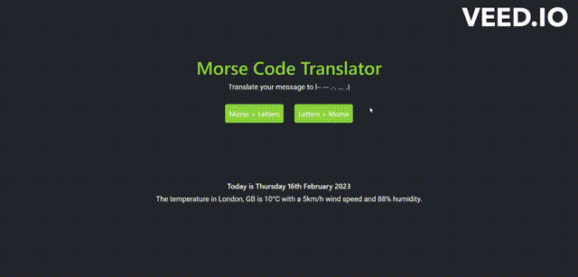
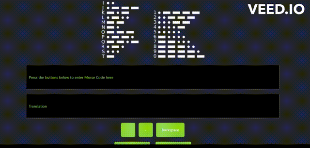
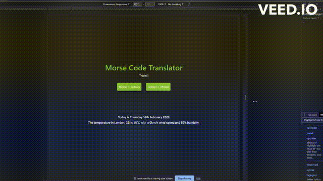

# Morse-to-Letter Translator

  

</br>

## Table of Contents
* [Description](#description)
* [Features](#features)
* [Installation & Deployment](#installation-and-deployment)
* [How to Use](#how-to-use)
* [License](#license)

</br>

</br>

## Description

This project presents a real-world situation in which the newfound JavaScript skills will come in handy. The code has been built to help users to communicate secretly using Morse code that has been widely used in aerospace, amateur radio operators, military, and army forces for communication. Users can encode and decode text messages from and to Morse code by selecting the type of translation that users need.

</br>



</br>
</br>

## Features

This application works in two different modes: Morse-to-Letter and Letter-to-Morse. Two different logics have been built to encode and decode the messages. This application also has been supported with two APIs to show users the current time and weather and a localstorage to save the translated data.

</br>

 

</br>
</br>

### Morse-to-Letter Translator

In morse-to-letter mode, the application can be used by clicking buttons to generate Morse code and translated message will be shown instantly in letters. Any translation that has been saved will be shown in the translate history.

</br>

 

</br>
</br>

### Letter-to-Morse Translator

In letter-to-morse mode, users can type directly in the text box area and the Morse code will be shown once the translate button is clicked. Similar to the previous mode, any translation that has been saved will be shown in the translate history and can also be cleared by clicking the `clear` button.

</br>

 

</br>
</br>

### Current Time and Weather APIs

[Moment.js](https://momentjs.com/) API has been used in this application to show users the current time and date. These features can be seen in the homepage right below the buttons.


Another API has been used in this application, [openweather](https://openweathermap.org/api). By using this API, a local weather of London can be seen in the homepage after the aforementioned current time feature.

</br>


</br>
</br>

### LocalStorage History

In both mode, a local storage is used to store translations that users wish to save. The application has been designed to show up to 3 latest saved translations in the form of buttons. Once the button is clicked, the application will do the saved translation and it will be in the translation boxes.

</br>

 

</br>

The application works by taking the values from text boxes and saving them into an 2-dimensional array, `[input, output]`. This array will be saved into another multi dimensional array that stores the other 2-dimensional array. As the code has been built to save up to 3 translations, the array will be `[[input1, output1], [input2, output2], [input3, output3]]`. The saved translation buttons and the local storage can be seen in the pictures below.

</br>


</br>


</br>
</br>

### Interactive and Attractive UI

Several animations have been implemented on the applications. In the homepage, users can hover texts and the morse code translation of those texts will appear. Another animation used here is a typewriting effect by implementing a package called [typewriter](https://www.npmjs.com/package/typewriter) provided by [npm](https://www.npmjs.com/) in the `html` file.

  ```html
    <script src="https://unpkg.com/typewriter-effect@latest/dist/core.js"></script>
  ```

</br>

While the animation itself is controlled by JavaScript code.

  ```javascript
    typewriter.typeString('Translate your message to letters')
    .pauseFor(2500)
    .deleteChars(7)
    .typeString('-- --- .-. ... .')
    .pauseFor(2500)
    .deleteAll()
    .start();
  ```

</br>

 

</br>

Moreover, the UI has also been designed to be responsive. Hence, this application can adapt to multiple devices with various screen sizes as shown below.

</br>

 

</br>
</br>

## Installation and Deployment

Installation not required, since this is a "plug and play" type of application. The user can simply run it locally by clicking on the `index.html` file and opening in either their default or preferred browser.

Application can also be accessed at following links:
* [GitHub repository](https://github.com/barrylui88/Morse-Code-Translator).
* [Deployed application](https://barrylui88.github.io/Morse-Code-Translator/).

</br>
</br>

## How to Use 

* Click `Morse > Letter` button to translate Morse code to letters.
    * Use the buttons under the text area to input the morse code.
    * A cheatsheet of Morse code has been provided on the top side of webpage.
    * Click `save` button to save the translation.
    * Click `clear` button to clear text boxes.
    * Use `back` button if you wish to go back to homepage.
    
</br>

* Click `Letter > Morse` button to translate letters to Morse code.
    * Type your alphabet message in text box and click `translate` to translate.
    * Click `save` button to save the translation.
    * Click `clear` button to clear text boxes.
    * Use `back` button if you wish to go back to homepage.

</br>
</br>

## License

Licensed under the [MIT license](https://github.com/git/git-scm.com/blob/main/MIT-LICENSE.txt). See LICENSE for the full details.
